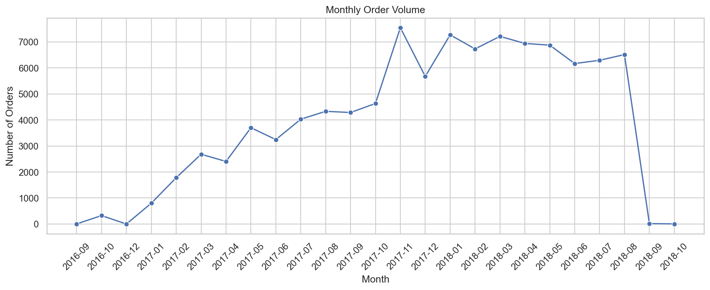
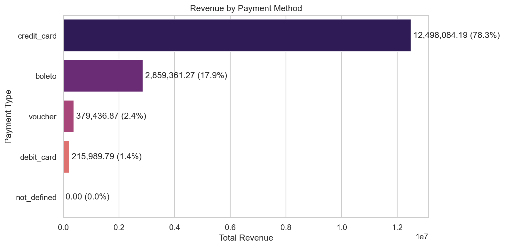
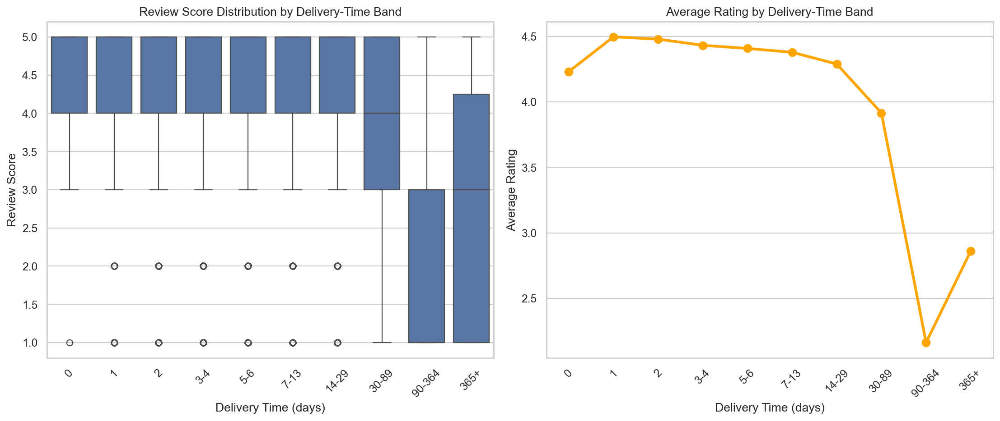
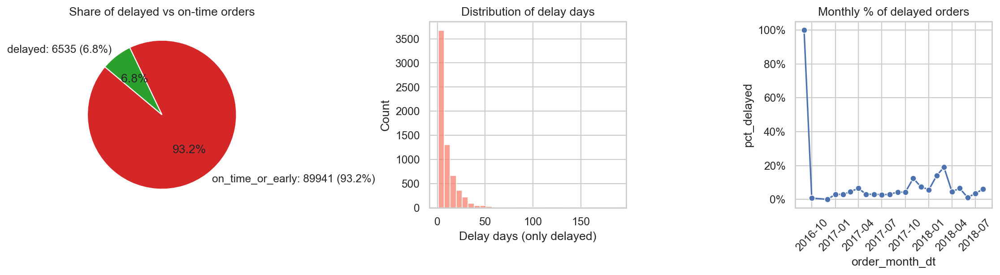
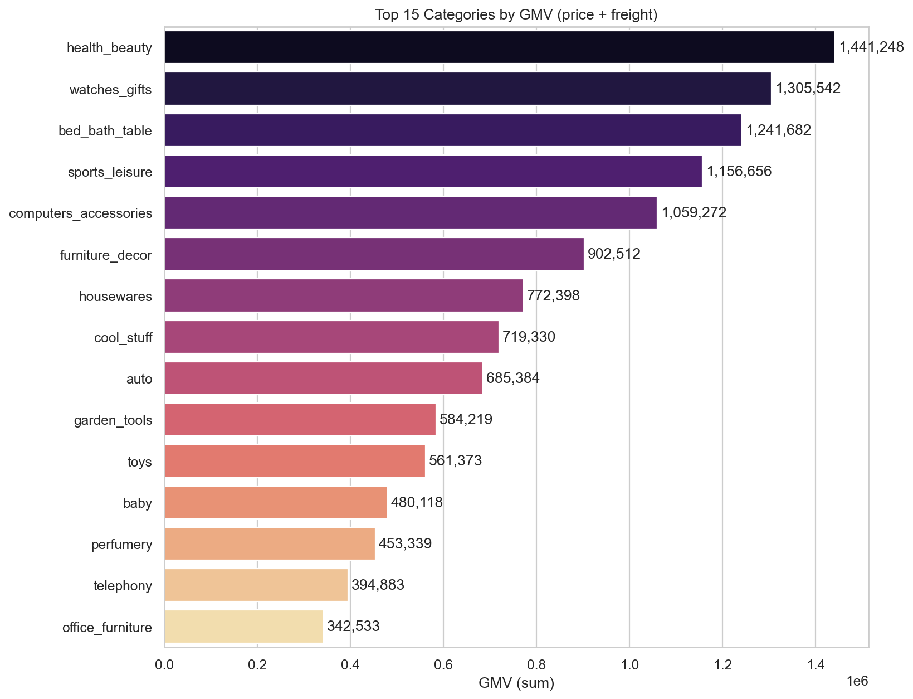
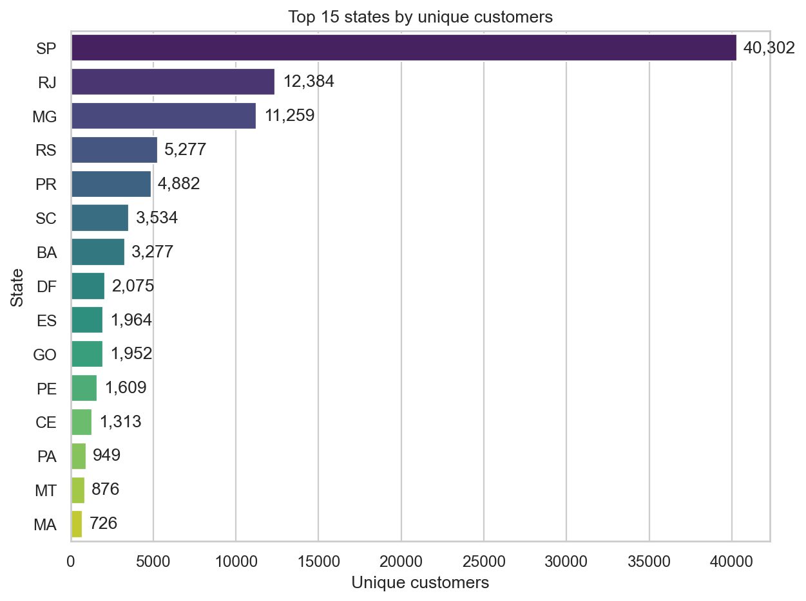
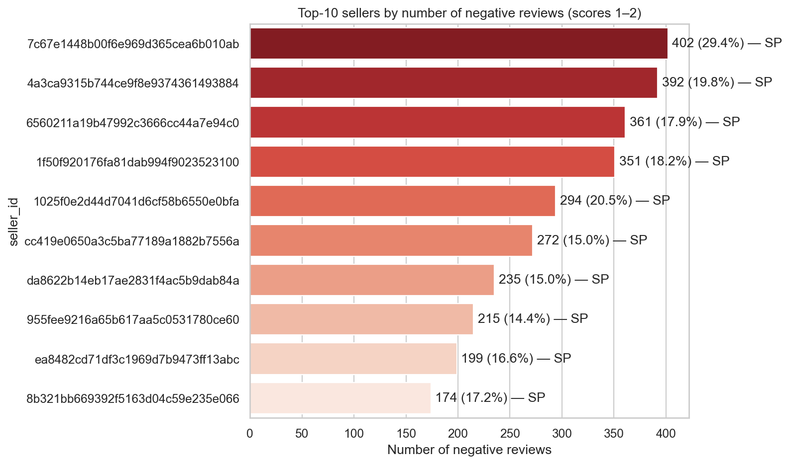
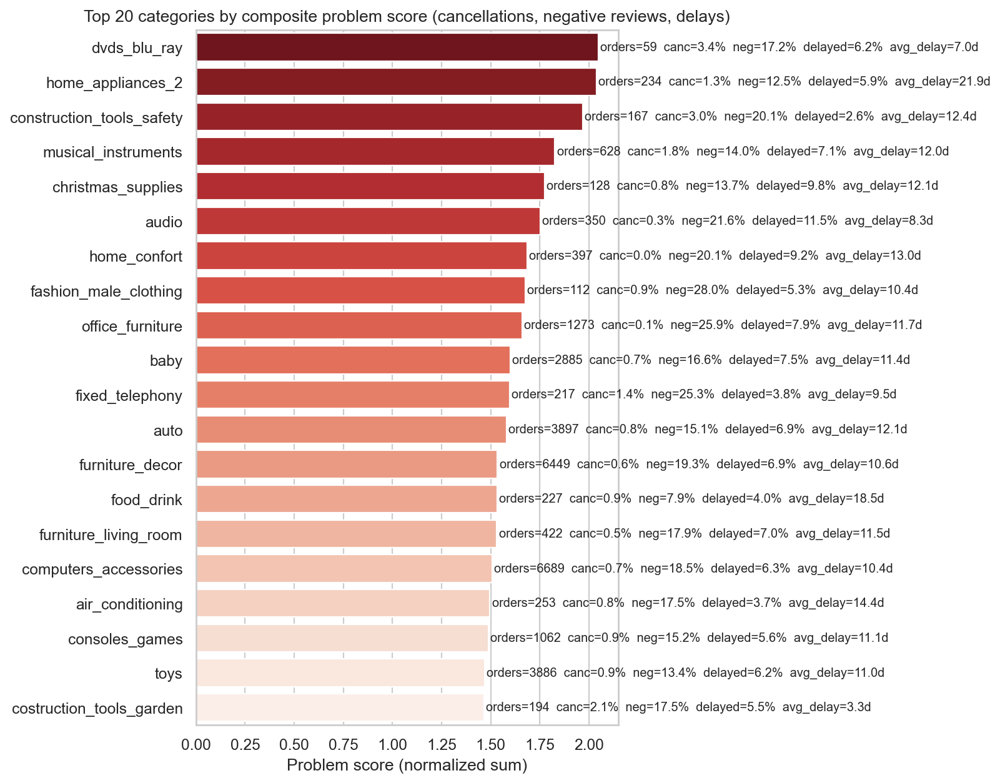

# E-commerce Data Analysis: Customer Behavior & Business Insights

Portfolio data analytics project based on the Brazilian Olist e-commerce dataset. The analysis combines SQL and Python to study revenue dynamics, customer behavior, payment preferences, review quality, delivery performance, seller risk, product categories, and regional growth opportunities.

## Business Goal

The goal is to turn marketplace transaction data into practical business insights:

- identify the main revenue drivers and category performance patterns;
- measure customer retention and repeat purchase behavior;
- find operational issues in delivery, cancellations, sellers, and reviews;
- detect regional demand and supply gaps;
- translate the analysis into business recommendations.

## Executive Snapshot

| Metric | Value |
| --- | ---: |
| Total orders | 99,441 |
| Unique customers | 96,096 |
| Sellers | 3,095 |
| Unique products sold | 32,951 |
| Average order value | 160.43 |
| Repeat purchase rate | 3.12% |
| Average review score | 4.09 / 5 |
| Negative review rate | 14.69% |
| Average delivery time | 12.09 days |
| Late delivery rate | 8.11% |
| Cancellation rate | 0.63% |

## Dataset

Source: Olist Brazilian E-commerce Public Dataset from Kaggle.

The local `data/` folder contains Excel versions of the original tables:

| Table | Rows | Purpose |
| --- | ---: | --- |
| `olist_orders_dataset.xlsx` | 99,441 | Order lifecycle and delivery timestamps |
| `olist_customers_dataset.xlsx` | 99,441 | Customer IDs, cities, states, zip prefixes |
| `olist_order_items_dataset.xlsx` | 112,650 | Product, seller, price, and freight per order item |
| `olist_order_payments_dataset.xlsx` | 103,886 | Payment methods, installments, and payment values |
| `olist_order_reviews_dataset.xlsx` | 99,224 | Review scores and review text fields |
| `olist_products_dataset.xlsx` | 32,951 | Product category and physical attributes |
| `olist_sellers_dataset.xlsx` | 3,095 | Seller city, state, and zip prefix |
| `olist_geolocation_dataset.xlsx` | 1,000,163 | Zip prefix geolocation data |
| `product_category_name_translation.xlsx` | 71 | Portuguese-to-English category mapping |

## Repository Structure

```text
.
├── data/                         # Dataset files and data notes
├── notebooks/
│   ├── pandas/                   # Python EDA and visualizations
│   └── sql/                      # SQL analysis in SQLite
├── sql/
│   └── business_questions.sql    # Clean, reviewed SQL query set
├── images/                       # Reserved for exported charts/screenshots
├── README.md
└── requirements.txt
```

## Portfolio Deliverables

- [SQL notebook](notebooks/sql/brazilian_e-commerce.ipynb): end-to-end SQLite analysis with business takeaways and recommendations.
- [Python notebook](notebooks/pandas/pandas_e-commerce.ipynb): visualization-focused EDA for sales, payments, reviews, logistics, sellers, products, geography, and risk.
- [Reviewed SQL query set](sql/business_questions.sql): clean 40-question SQL reference for repeatable analysis.
- [Chart gallery](images/): 33 exported visuals generated from the Python notebook.

## Visualization Gallery

| Sales & GMV | Payments |
| --- | --- |
|  |  |

| Reviews & Delivery | Logistics Risk |
| --- | --- |
|  |  |

| Product Categories | Geographic Demand |
| --- | --- |
|  |  |

| Seller Risk | Composite Business Risk |
| --- | --- |
|  |  |

## Analysis Scope

The project is organized around 40 analytical questions grouped into 10 blocks:

1. General business overview
2. Sales dynamics and GMV
3. Customer behavior and CLV
4. Payment analysis
5. Customer reviews
6. Logistics and delivery delays
7. Seller analysis
8. Product category analysis
9. Geographic analysis
10. Business risks and cancellations

## Key Insights

- The platform is highly acquisition-driven: the average customer places close to one order, and repeat purchases are low.
- Credit card payments generate the largest share of total revenue, while vouchers show a high average order value and may be useful for retention campaigns.
- Delivery time is strongly connected with customer satisfaction: longer delivery windows are associated with lower review scores.
- Around 8% of delivered orders are late versus the estimated delivery date.
- Office furniture and other bulky categories show weak review performance and long delivery times, making them high-priority operational risk areas.
- Sao Paulo is the largest customer and seller market, but other states show demand/supply gaps that may create regional growth opportunities.
- Some sellers have a high negative review rate and should be monitored through seller quality controls and SLA policies.

## Business Recommendations

- Improve retention with email marketing, personalized recommendations, voucher campaigns, and post-purchase flows.
- Prioritize delivery improvements for high-volume states and slow categories.
- Create seller quality monitoring based on negative review rate, delivery delays, and cancellation patterns.
- Use regional strategies: increase average order value in SP, scale demand in RJ/MG, and recruit sellers in underserved states.
- Add realistic ETA communication for slow categories and regions to reduce dissatisfaction.

## How to Run

1. Create and activate a virtual environment.

```bash
python3 -m venv .venv
source .venv/bin/activate
```

2. Install dependencies.

```bash
pip install -r requirements.txt
```

3. Open the notebooks.

```bash
jupyter notebook
```

Recommended order:

1. `notebooks/sql/brazilian_e-commerce.ipynb`
2. `notebooks/pandas/pandas_e-commerce.ipynb`

The notebooks use project-root relative paths, so they can be run from the repository root or from inside the notebook folders.

## Technical Notes

- SQL analysis uses an in-memory SQLite database created from the Excel files.
- The notebooks include a cleaning step for monetary columns because some Excel exports auto-format decimal values as dates.
- Payment metrics aggregate payment rows to order level before calculating AOV and revenue.
- Delivery delay is calculated as `delivered_customer_date - estimated_delivery_date`; positive values mean late delivery.
- Review-risk metrics focus on scores `1` and `2` as negative reviews.
- Geolocation has multiple rows per zip prefix, so distance-related analysis should aggregate zip coordinates before joining.

## Skills Demonstrated

- Exploratory data analysis with Python
- SQL joins, aggregations, CTEs, window functions, and business metrics
- Data cleaning and metric definition
- Customer, seller, product, logistics, and regional analysis
- Translating analytical results into business recommendations
